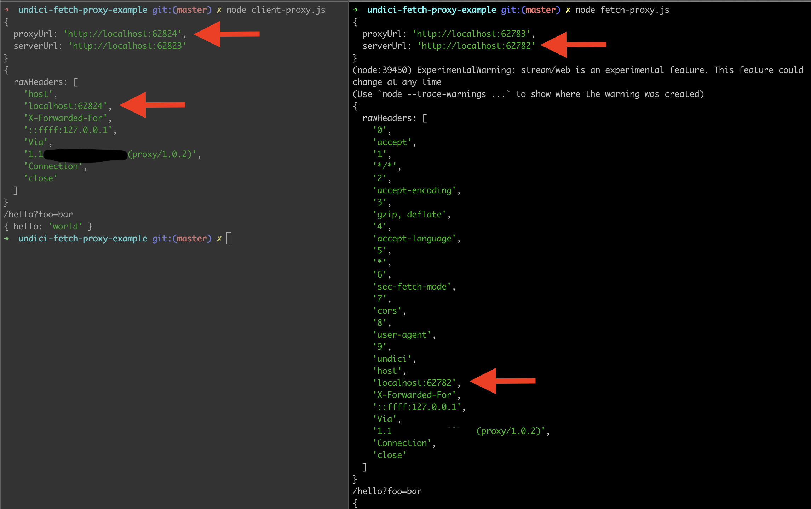

In order to replicate the results.

Setup:
- Clone repo.
- Run `npm ci`

1. Run client-proxy.js
This file is a slight modification of the example provided in [best-practices/proxy.md](https://github.com/nodejs/undici/blob/main/docs/best-practices/proxy.md). In this example rawHeaders show host to be a proxyUrl. [See left side of terminal in screenshot below]

2. Run fetch-proxy.js
This file is an adjustement of the client-proxy.js example, but uses fetch API. In this example rawHeaders show host as serverUrl - what makes me believe that this example is not working with the proxy setup as is. [See right side of terminal in screenshot below]

- Question 1: What is the correct way of setting up undici fetch API to work with proxy?
- Question 2: Is there a better way to check if proxy is being used other that peeking at rawHeaders?
